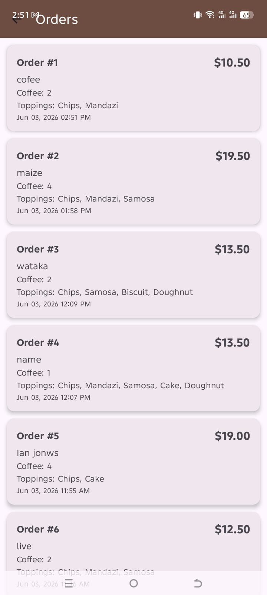
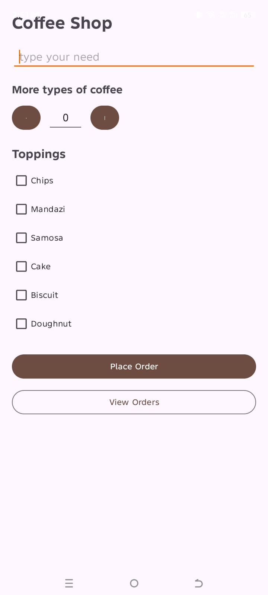

# Coffee Shop Booking

An Android app for ordering coffee and snacks. Built with Java and Firebase Realtime Database.

## Features

- Place coffee orders with adjustable quantity
- Select from various toppings (Chips, Mandazi, Samosa, Cake, Biscuit, Doughnut)
- Real-time price calculation
- View all past orders in a list
- Firebase-powered order storage

## Tech Stack

- **Language:** Java
- **UI:** Material 3, RecyclerView, CardView
- **Backend:** Firebase Realtime Database
- **Build System:** Gradle with Kotlin DSL

## License

MIT
